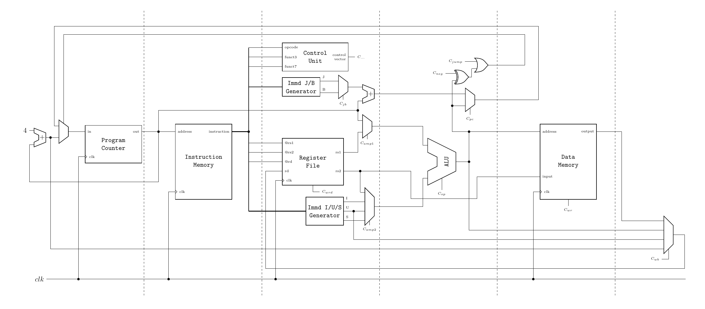

# Clockwork

Clockwork is a RISC-V softcore built for educational purposes.

## Specifications

- RV32I instruction set implementation,
- 5-stage pipeline,
- Direct-mapped instruction cache,
    - 512 instructions organized into 64 cache lines.

# Architecture diagram

Dotted lines represent locations of pipeline registers and which signals are handled by a register when crossed by one of the lines.

## Next steps

- Implement a data cache:
    - in an enhanced Von-Neumann way i.e. both I-cache and D-cache accessing from the same memory space,
- Implement memory fences instructions:
    - missing features from RV32I specs,
- Implement a forwarding unit:
    - currently, instruction with data dependencies to a previous instruction still in the pipeline are waiting for the instruction completion (past write-back),
- Implement other extensions from the ISA specifications:
    - interrupts controller,
    - timers.

